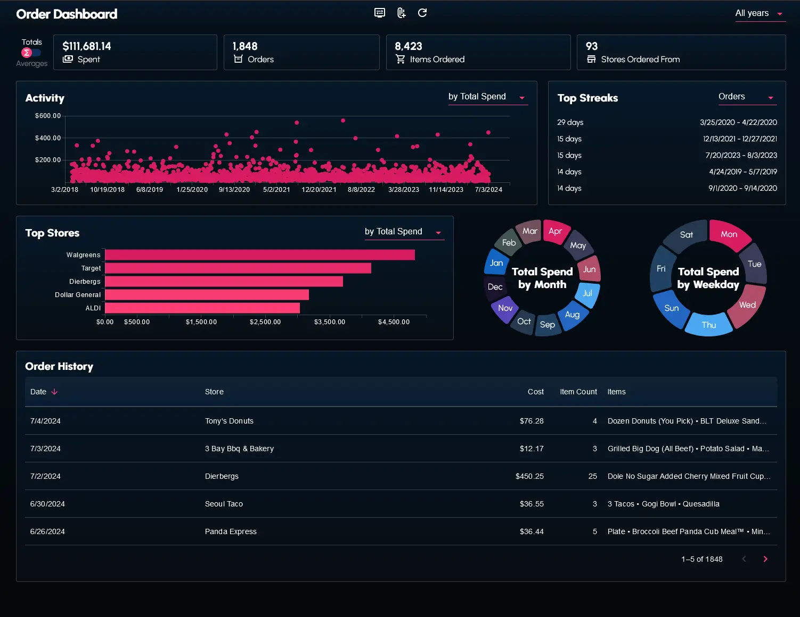

# Order Dashboard

I rather enjoy being referred to as a "DoorDash VIP" when I call their customer support, despite the fact that being a DoorDash VIP is probably not a good thing. I knew my DoorDash spending habits were bad, but how bad warranted VIP status? DoorDash didn't have the tools for analyzing my spending, curiosity led me to leveraging my programming skills for insight. I wrote some scripts to get my order history data, then I created my own analytics dashboard.

*Note: The dashboard is initialized with random data (not my actual order history). Said data can be shuffled by clicking the refresh icon in the navbar. Anyone can supply a valid JSON to the dashboard and it will visualize that data instead via clicking on the attach/add icon in the navbar.*

The dashboard is deployed [here](https://main.d1rdpoich583rp.amplifyapp.com/)

[Visit the website](https://main.d1rdpoich583rp.amplifyapp.com/)

## Table of Contents

- [Technologies Used](#technologies-used)
- [Getting the order data](#getting-the-order-data)
- [Screenshots](#screenshots)
  - [Desktop](#desktop)
  - [Mobile](#mobile)

## Technologies Used

- React
- TypeScript
- JavaScript
- Firefox
  - Firefox Developer Tools
- Python
- HTML
- CSS
- Material UI (for inputs)
- Material UI X Charts (for charts and data grid)
- Zod

## Getting the order data

The method I used to get my order data is relatively primitive and volatile, considering it isn't fully automated and is based on a particular version of the DoorDash website. If DoorDash updates the order history page, the script used to grab the order history will likely fail. This was sufficient for the scope of the project as I didn't anticipate much value in repeating this process. The value being to recognizes spending habits, not to monitor changes to those habits.

Two scripts were used to get my order data. One script parses the data (`webScraper.js`). The other script transforms that data into a format better suited for performing analysis (`transform_data.py`). The exact steps for using the scripts can be found below:

### Web scraping

1. Log in to your DoorDash account via the DoorDash website.
2. Visit the order history page on the DoorDash website.
3. Open the developer tools from the order history page.
4. Copy and paste the JavaScript from `webScraper.js` into the dev console.
5. Press Enter key and wait for script to finish running.
6. Once the script is complete, copy the message printed in the dev console into a JSON file.

### Transforming data

1. Run the `transform_data.py` script and point it to the JSON file created of the order data printed from `webScraper.js`.

## Screenshots

### Desktop

#### Default view

#### After toggling KPIs from Totals to Averages

#### Dropdown for switching between years for visualizations

### Mobile

